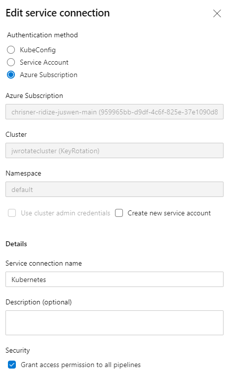
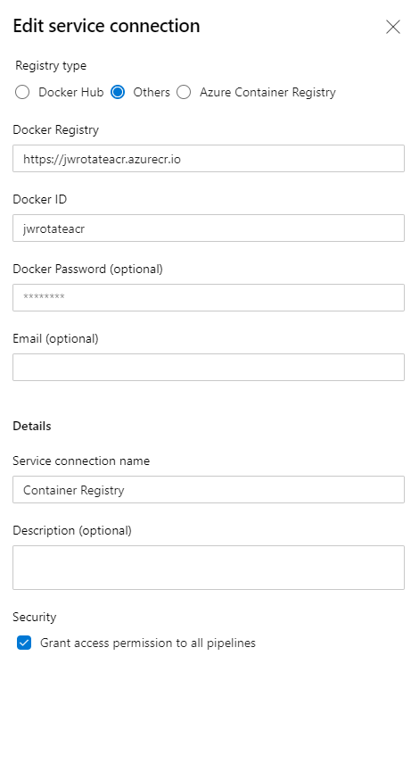

# Running from Azure Pipelines

The pipeline files can be found under the ~/PostgreKeyRotation/Deployment. The file named pg-keyrotation-ci.yml creates the environment and pg-keyrotation-pipeline.yml shows an example of deploying using blue / green deployments.

This documentation assumes there is an existing Azure DevOps organization and project setup and that we are creating new Azure Pipelines to handle the automation of this deployment. If that is not the case, please follow the guidance on the Azure DevOps [docs page](https://docs.microsoft.com/en-us/azure/devops/organizations/accounts/create-organization?view=azure-devops).

## Steps

- Create the Azure Resource Manager service connection below.
- Update the pipelines to replace tokens as per below.
- Create a new pipeline called "CI Build" and select an existing yaml pipeline that points to pg-keyrotation-ci.yml.
- Create the variable groups like below.
- Run the pipeline.
- Create a new pipeline called "Rotate Deployment" and select an existing pipeline that points to pg-keyrotation-pipeline.yml
- Run that pipeline.

## Replacement Tokens

These are tokens found in the two pipeline files that need to be replaced.

| Token | File | Description |
|-----|-----|-----|
| service-principal-name | pg-keyrotation-ci | The service connection name for the Azure Resource Manager service connection |
| subscription-id | pg-keyrotation-ci | The subscription id for your Azure Subscription |
| database-server-name | pg-keyrotation-ci | The database server name for postgre |
| database-name | pg-keyrotation-ci | The database name deployed on the server above |
| azure-subscription-id | pg-keyrotation-pipeline | The Azure subscription id |
| database-server-name | pg-keyrotation-pipeline | The database server name for postgre |
| database-name | pg-keyrotation-pipeline | The database name deployed on the server above |
| database-admin-role | pg-keyrotation-pipeline | The admin username for postgre |

## Variable Groups

key-rotation-variables:

| Variable | Description |
|-----|-----|
| currentActiveRole | Whether using "pgapproleblue" or "pgapprolegreen" |

pipeline-variables:

| Variable | Description |
|-----|-----|
| buildConfiguration | The build configuration (Release or Debug) |
| buildTag | The build id from devops |
| imageName | The image name of your container in ACR |

## Setting up the Environment

This pipeline (pg-keyrotation-ci.yml) requires both variable groups from above.

## Deploying via Blue / Green Deployments

This pipeline (pg-keyrotation-pipeline.yml) requires both variable groups from above.

## Service Connections Required

### Azure Resource Manager

This will require an Azure Resource Manager service connection as well.

### Kubernetes

Need to setup a Kubernetes service connection. This step has to be done after the pg-keyrotation-ci.yml pipeline has been run.

### Azure Container Registry

Need to setup an Azure Container Registration service connection. This has to be done after the pg-keyrotation-ci.yml pipeline has been run.

